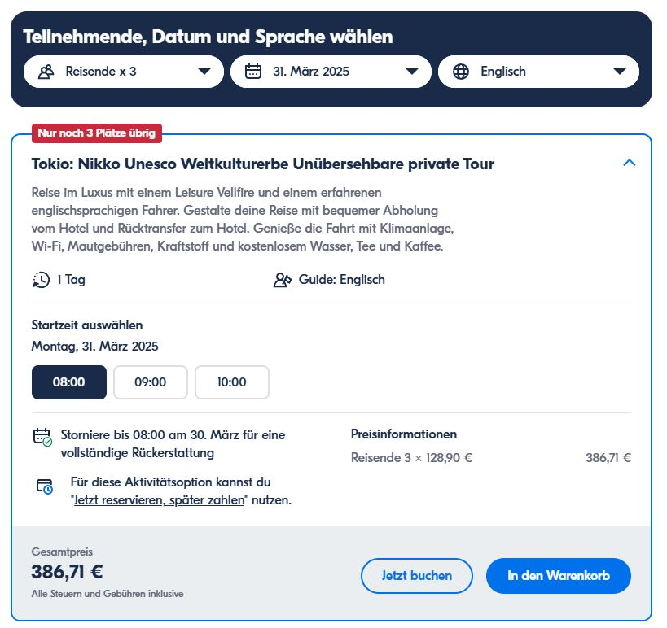

# Alle Touren

- [Alle Touren](#alle-touren)
- [Nikko](#nikko)
  - [Tokio: Nikko Unesco Weltkulturerbe Unübersehbare private Tour](#tokio-nikko-unesco-weltkulturerbe-unübersehbare-private-tour)
  - [Nikkos majestätische Landschaften: Private Guided Tour](#nikkos-majestätische-landschaften-private-guided-tour)
  - [Tokio: Nikko National Park Private Tagestour mit Fahrer](#tokio-nikko-national-park-private-tagestour-mit-fahrer)
- [Fuji](#fuji)
- [Hubschrauber Rundflug Tokio](#hubschrauber-rundflug-tokio)
- [Osaka](#osaka)
  - [Osaka: Universal Studios Japan E-Ticket](#osaka-universal-studios-japan-e-ticket)
  - [Osaka: Namba Pub Bar Crawl mit einem ortskundigen Guide](#osaka-namba-pub-bar-crawl-mit-einem-ortskundigen-guide)
  - [Osaka: Historischer Rundgang durch das Rotlichtviertel und das Ghetto](#osaka-historischer-rundgang-durch-das-rotlichtviertel-und-das-ghetto)
  - [Osaka: Authentisches Izakaya Bar Hop mit einem Einheimischen](#osaka-authentisches-izakaya-bar-hop-mit-einem-einheimischen)
  - [Nara und Nara-Park](#nara-und-nara-park)

# Nikko

Auf "getyourguide" Touren beschränkt.
Unterscheidung Gruppen-Touren vs. private Touren als Kleingruppe.

Vorteil der Kleingruppe: 
- flexible Startzeiten (auch erst um 10 Uhr)
- Abholung am Hotel

Nachteil:
- Preis (statt ca 80 € pro Person ca 120-150 €, sprich 350-400€ als Gruppe)

Such-Liste: 
https://www.getyourguide.de/nikko-l89510/bus-und-minivan-touren-tc4?date_from=2025-03-27&date_to=2025-03-27&sort=price&order=asc

Folgende "private" Touren gefunden:

## Tokio: Nikko Unesco Weltkulturerbe Unübersehbare private Tour

Preis gesamt: 386,71 €

https://www.getyourguide.de/tokio-l193/tokio-nikko-unesco-weltkulturerbe-unubersehbare-private-tour-t798727?date_from=2025-03-31&date_to=2025-03-27&lang=en&_pc=1,3

Beispiel Buchungsdetails, flexible Startzeit:

## Nikkos majestätische Landschaften: Private Guided Tour

Preis gesamt: 355,53 €

https://www.getyourguide.de/nikko-l89510/nikkos-majestatische-landschaften-private-guided-tour-t841137?date_from=2025-03-31&date_to=2025-03-27&lang=en&_pc=1,3

## Tokio: Nikko National Park Private Tagestour mit Fahrer

Preis gesamt: 358,64 €

https://www.getyourguide.de/tokio-l193/tokio-nikko-national-park-private-tagestour-mit-fahrer-t891181?date_from=2025-03-31&date_to=2025-03-27&_pc=1,3

# Fuji

Evtl. selbst bis nach Kawaguchiko und dann mal schauen. 
Oder nochmal googeln...

# Hubschrauber Rundflug Tokio

Leider sehr teuer; preislich ok bedeutet dann, nur max. 15 Minuten.

https://www.tripadvisor.de/AttractionProductReview-g1066449-d17718003-15mins_4pax_Tokyo_Bay_Coastal_Tokyo_Skytree_and_Tokyo_Station-Koto_Tokyo_Tokyo_Pr.html

# Osaka

## Osaka: Universal Studios Japan E-Ticket

Preis 116 €

https://www.getyourguide.de/universal-studios-japan-l80971/osaka-universal-studios-japan-e-ticket-t129258/?ranking_uuid=537eee48-d5e7-45a3-801d-a47e860d32d0&date_from=2025-04-07&date_to=2025-04-10

## Osaka: Namba Pub Bar Crawl mit einem ortskundigen Guide

Preis 34,31 €

https://www.getyourguide.de/osaka-l1204/osaka-namba-pub-bar-crawl-mit-einem-ortskundigen-guide-t640286/?ranking_uuid=20338a8a-65cc-43d5-a160-137f053fa47a&date_from=2025-04-07&date_to=2025-04-10

## Osaka: Historischer Rundgang durch das Rotlichtviertel und das Ghetto

Preis: 24,95

https://www.getyourguide.de/osaka-l1204/osaka-historischer-rundgang-durch-das-rotlichtviertel-und-das-ghetto-t882427?date_from=2025-04-07&date_to=2025-04-10&_pc=1,1

## Osaka: Authentisches Izakaya Bar Hop mit einem Einheimischen

Preis: 37,42

https://www.getyourguide.de/osaka-l1204/osaka-authentisches-izakaya-bar-hop-mit-einem-einheimischen-t885397/?date_from=2025-04-07&date_to=2025-04-10

## Nara und Nara-Park

Lässt sich super per Bahn erreichen und dann kann man auch selbst in den Park rein und es erkunden.